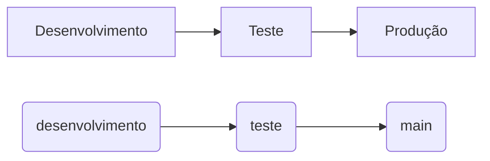

# Internet das Coisas (IOT) como solução para a logística no agronegócio.

## Resumo
Visando mitigar a insegurança nas condições do transporte, a falta de informação sobre localização do caminhão e carga, além das inúmeras perdas do carregamento durante o trajeto, seja por meio de acidentes ou apodrecimento de perecíveis, donos de frota e transportadoras necessitam cada vez mais de sistemas de monitoramento e rastreamento. Diante de tais problemas, a solução criada vem com o objetivo de trazer uma análise de dados em tempo real das frotas e cargas, aplicando o uso de IOT para tais soluções. 

### O problema
Através de pesquisa de mercado, é possível encontrar diversas soluções de segurança e monitoramento de transporte de cargas. Um ponto fraco facilmente perceptível em grande parte delas, se dá no fato de apenas se extenderem à localização geográfica dos caminhões, sem oferecerem maiores informações de segurança no que se diz respeito à carga em si, trazendo pontos de fragilidade, imprecisão e incerteza à logística de transporte no agronegócio.
Alto custo final de logística  

### Objetivo
A finalidade principal da solução é trazer o monitoramento de dados referentes à temperatura, umidade, níveis de gases, balanço e trepidações da carga durante seu trajeto até seu destino final. A análise de dados é feita tanto durante a entrega, quanto posteriormente, para não só monitorar a carga, como também para identificar falhas e pontos fracos a fim de melhor administrar a logística de transporte.

### Público-alvo
O sistema tem como publico-alvo donos de frotas, transportadores e distribuidores.

## Gerenciamento do projeto
De acordo com a 6ª edição do PMBoK, as dez áreas constituintes dos pilares de gerenciamento de projetos, e que caracterizam a multidisciplinaridade envolvida, são: Integração, Escopo, Cronograma (Tempo), Custos, Qualidade, Recursos, Comunicações, Riscos, Aquisições, Partes Interessadas. Seguindo essa linha de raciocínio, para concluir o projeto em tempo hábil, um bom manuseamento de cronograma aliado à distribuição de recursos elaborada de maneira eficiente mostrou-se um passo essencial.

### Metodologia de Versionamento
Em conformidade com a lógica apresentada, dividimos nosso desenvolvimento em uma sequência de três passos, desenvolvimento, teste e produção. Passos esses que foram divididos em branches dentro de nosso repositório no github:

#### Passos e Branches

#### Desenvolvimento
Durante a fase de desenvolvimento são produzidos os códigos e todos os outros artefatos necessários para a realização do projeto, dentro da branch desenvolvimento. Toda funcionalidade concluida é enviada para a brench teste.
#### Teste
Durante a fase de teste as funcionalidades passam por uma sessão de QA, onde bugs e fragilidades são detectadas e corrigidas. Ao atingirem o nivel necessário de satisfação são enviados para a branch main.
#### Produção
A produção é representada pela branch main e guarda todo o código desenvolvido e testado pela equipe.

### Ferramentas utilizadas

|Função    | Plataforma  | Link de Acesso |
|------|-----------------------------------------|----|
| Ferramenta de comunicação | Discord| [discord.com](https://discord.com/)|
| Versionamento de código |Github| [github.com](https://github.com/ViFMarques/Hackathon-StartSe)|
| Organização de tarefas | Trello | [trello.com](https://trello.com/)|
| Ferramenta de diagramação e projeto de interfaces | Figma | [figma.com](https://www.figma.com/)|
| Editor de código | Visual Studio Code| [visualstudio.com](https://code.visualstudio.com/)|

### Tecnologias utilizadas

| Função | Nome | Link de acesso |
|---------------------|----------------|----------|
| Esqueleto da página web| HTML | [developer.mozilla](https://developer.mozilla.org/pt-BR/docs/Web/HTML)|
| Estilização da página web | CSS |[developer.mozilla](https://developer.mozilla.org/pt-BR/docs/Web/CSS)| 
| Manipulação de dados pra página web |JavaScript |[javascript.com](https://www.javascript.com/)|
| Fontes customizadas da página web |Google Fontes |[fonts.google.com](https://fonts.google.com/)|
| ícones para a página web | Bootstrap Icons | [icons.getbootstrap.com](https://icons.getbootstrap.com/)|
| Gráficos customizados para a página web | Canvasjs | [canvasjs.com](https://canvasjs.com/)|
| Sistema de servidores nuvem | Heroku | [heroku.com](https://www.heroku.com/)|
| Manipulação do banco de dados| Nodejs | [Nodejs](https://nodejs.org/en/)|
| Banco de dados |My SQL |[mysql.com](https://www.mysql.com/)| 

## Wireframes

## Requisitos Funcionais

|ID       | Descrição do Requisito                                                            |Prioridade|
|---------|----------             |------|
|RF-1  |Permitir que o usuário efetue login                                                                          | ALTA |
|RF-2  |Permitir que o usuário efetue logout                                                                         | ALTA |
|RF-3  |Permitir que o usuário visualize a temperatura da carga                                                      | ALTA |
|RF-4  |Permitir que o usuário obtenha informações sobre a localização da carga                                      | ALTA |
|RF-5  |Permitir que o usuário visualize o movimentar/ balanço da carga                                              | ALTA |
|RF-6  |Permitir que o usuário visualize status/avisos sobre acidentes, altas temperatura da carga e furto de carga  | ALTA |
|RF-7  |Permitir que o usuário entre em contato com a empresa                                                        | ALTA |
|RF-8  |Permitir que o usuário conheça os beneficios/vantagens/soluções que o produto tem                            | ALTA |

## Requisitos Não Funcionais

|ID     |Descrição do Requisito                                                               |Prioridade|
|-------|-------------------------------------------------------------------------------------|----------|
|RNF-1  |O sistema deve focado para o uso em desktop                                          |     ALTA |
|RNF-2  |O sistema deve funcionar nos principais sistemas operacionais                        |     ALTA |
|RNF-3  |O sistema deve funcionar nos principais navegadores                                  |     ALTA |
|RNF-4  |As requisições devem ser leves para funcionar bem em áreas mais remotas              |     ALTA |
|RNF-5  |O formulário de login do usuário tem que ser de fácil preenchimento e compreensão    |    MÉDIO |

## Modelagem do Processo de Negócio

Análise da Situação Atual

Descrição Geral da Proposta

## Programação de Funcionalidades

Nesta seção apresentamos as telas desenvolvidas para cada uma das funcionalidades do sistema:

### Landing Page 
A página apresenta informações sobre a solução do software, um botão de teste grátis e um botão de Login.

### Instrução de Acesso
Para efetuar login clique em "acesse", para experimentar o produto ou entrar em contato com a empresa clique em "teste grátis", para conhecer quais problemas nosso produto ameniza, clique em "soluções".
### Requisitos Atendidos
RNF-1 ,RNF-2 e RNF-3.

### Login 
A página Login apresenta um formulário com dois campos: email e senha, que permite que o usuário inicie uma sessão no sistema.

### Instrução de Acesso
Na landing page clique no botão "acesse".
### Requisitos Atendidos
RF-1 e RNF-5.

### Dashboard
Exibe uma barra lateral de funcionalidades e o monitoramento de dados, podendo ser vizualido o prazo para a entrega, nome do motorista, status da operação, botão do pânico, dados do veículo, localização, prazo de entrega, balanço e dados da carga(temperatura, umidade e nivel de gás etileno). 

### Instrução de Acesso
A página é exibida após realizar login.
### Requisitos Atendidos
RF-2, RF-3, RF-4, RF-5, RF-6 e RNF-4.

