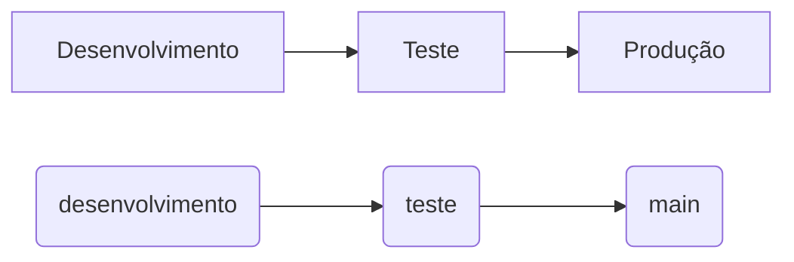

# Internet das Coisas (IOT) como solução para a logística no agronegócio.

## Resumo
Visando mitigar a insegurança nas condições do transporte, a falta de informação sobre localização do caminhão e carga, além das inúmeras perdas do carregamento durante o trajeto, seja por meio de acidentes ou apodrecimento de perecíveis, donos de frota e transportadoras necessitam cada vez mais de sistemas de monitoramento e rastreamento. Diante de tais problemas, a solução criada vem com o objetivo de trazer uma análise de dados em tempo real das frotas e cargas, aplicando o uso de IOT para tais soluções. 

### O problema
Através de pesquisa de mercado, é possível encontrar diversas soluções de segurança e monitoramento de transporte de cargas. Um ponto fraco facilmente perceptível em grande parte delas, se dá no fato de apenas se extenderem à localização geográfica dos caminhões, sem oferecerem maiores informações de segurança no que se diz respeito à carga em si, trazendo pontos de fragilidade, imprecisão e incerteza à logística de transporte no agronegócio.

### Objetivo
A finalidade principal da solução é trazer o monitoramento de dados referentes à temperatura, umidade, níveis de gases, balanço e trepidações da carga durante seu trajeto até seu destino final. A análise de dados é feita tanto durante a entrega, quanto posteriormente, para não só monitorar a carga, como também para identificar falhas e pontos fracos a fim de melhor administrar a logística de transporte.

### Público-alvo
O sistema tem como publico-alvo donos de frotas, transportadores e distribuidores.

## Gerenciamento do projeto
De acordo com a 6ª edição do PMBoK, as dez áreas constituintes dos pilares de gerenciamento de projetos, e que caracterizam a multidisciplinaridade envolvida, são: Integração, Escopo, Cronograma (Tempo), Custos, Qualidade, Recursos, Comunicações, Riscos, Aquisições, Partes Interessadas. Seguindo essa linha de raciocínio, para concluir o projeto em tempo hábil, um bom manuseamento de cronograma aliado à distribuição de recursos elaborada de maneira eficiente mostrou-se um passo essencial.

### Metodologia de Versionamento
Em conformidade com a lógica apresentada, dividimos nosso desenvolvimento em uma sequência de três passos, desenvolvimento, teste e produção. Passos esses que foram divididos em branches dentro de nosso repositório no github:

#### Passos e Branches

#### Desenvolvimento
Durante a fase de desenvolvimento são produzidos os códigos e todos os outros artefatos necessários para a realização do projeto, dentro da branch desenvolvimento. Toda funcionalidade concluida é enviada para a brench teste.
#### Teste
Durante a fase de teste as funcionalidades passam por uma sessão de QA, onde bugs e fragilidades são detectadas e corrigidas. Ao atingirem o nivel necessário de satisfação são enviados para a branch main.
#### Produção
A produção é representada pela branch main e guarda todo o código desenvolvido e testado pela equipe.
### Ferramentas utilizadas

|Função    | Plataforma  | Link de Acesso |
|------|-----------------------------------------|----|
| Ferramenta de comunicação | Discord| [discord.com](https://discord.com/)|
| Versionamento de código |Github| [github.com](https://github.com/ViFMarques/Hackathon-StartSe)|
| Organização de tarefas | Trello | [trello.com](https://trello.com/)|
| Ferramenta de diagramação e projeto de interfaces | Figma | [figma.com](https://www.figma.com/)|
| Editor de código | Visual Studio Code| [visualstudio.com](https://code.visualstudio.com/)|

## Wireframes

## Requisitos Funcionais

|ID    |Descrição do Requisito                                                                             |Prioridade|
|------|---------------------------------------------------------------------------------------------------|----------|
|RF-1  |Permitir que o usuário crie cadastro                                                               |     ALTA |
|RF-2  |Permitir que o usuário efetue login                                                                |     ALTA |
|RF-3  |Permitir que o usuário efetue logout                                                               |     ALTA |
|RF-4  |Permitir que o usuário visualize a temperatura da carga                                            |     ALTA |
|RF-5  |Permitir que o usuário obtenha informações sobre a localização da carga                            |     ALTA |
|RF-6  |Permitir que o usuário visualize o movimentar/ balanço da carga                                    |     ALTA |
|RF-7  |Permitir que o usuário receba notificações sobre acidentes, temperatura da carga e perda de carga  |     ALTA |

## Requisitos Não Funcionais

|ID     |Descrição do Requisito                                                                                                               |Prioridade|
|-------|-------------------------------------------------------------------------------------------------------------------------------------|----------|
|RNF-1  |O sistema deve focado para o uso em desktop                                                                                          |     ALTA |
|RNF-2  |O sistema deve funcionar nos principais sistemas operacionais                                                                        |     ALTA |
|RNF-3  |O sistema deve funcionar nos principais navegadores                                                                                  |     ALTA |
|RNF-4  |As requisições devem ser leves para funcionar bem em áreas mais remotas                                                              |     ALTA |
|RNF-5  |O formulário de registro de usuário tem que ser de fácil preenchimento e compreensão                                                 |   MÉDIO  |
